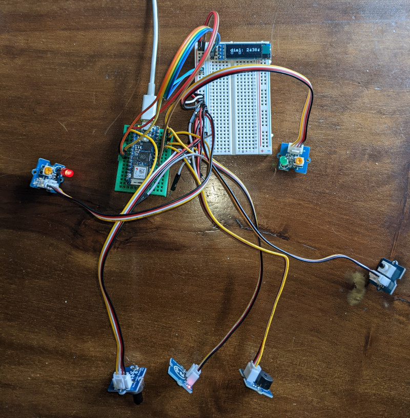

# Gophercon EU 2026 Hardware Hack Session

The is the repository for the hardware hack session at Gophercon EU 2026.

https://www.gophercon.eu/

### Please return all borrowed equipment when you are finished for the next person. Thank you!

## TinyGo Programmable Badges

Did you bring your badge with you from a previous year? Flash it with the latest software!

- [Badger2040-W](https://github.com/hybridgroup/badger2040)
- [GoBadge](https://github.com/tinygo-org/gobadge)

Do you want a TinyGo nametag or programmable badge? We have just a few with us today... Ask us!

## Installation

Please read our [installation instructions here](./INSTALL.md).

## Activities

These are some of the activities you can do with the hardware we have available. But that is only a starting point! Explore, experiment, learn, and have fun!

- [TinyGo Xiao IoT sensor](#tinygo-iot-sensor)
- [Parrot Minidrone](#parrot-minidrone)
- [WowWee MiP robot](#wowwee-mip-robot)
- [Sphero Mini robot](#sphero-mini-robot)

Post your robot picture and videos using hashtag #gopherconeu

### TinyGo IoT sensor

Looking for the true "parts experience"? Got you covered! We have brought some Seeed Studio Xiao ESP32-C3 IoT microcontroller boards for each person to use for the activity.

https://www.seeedstudio.com/Seeed-XIAO-ESP32C3-p-5431.html

These can be programmed using TinyGo.

There are some Grove sensor kits that you can use for the activity.

Ready to try this out? Go to [./sensor/xiao/](./sensor/xiao/) to get started.

### Parrot Minidrone

We have Parrot Minidrones you can fly with Go code to control them using their built-in Bluetooth API.

Ready for takeoff? Go to [https://github.com/hybridgroup/tinygo-minidrone](https://github.com/hybridgroup/tinygo-minidrone).

### WowWee MiP robot

Along for the ride, we brought a couple of WowWee MiP two-wheeled self-balancing robots that you control using Bluetooth.

Ready to roll? Go to https://github.com/hybridgroup/tinygo-mip.

### Sphero Mini robot

You need more robots? Of course you do! We brought a few Sphero Mini ball-shaped robots that you control using Bluetooth.

Keep on rolling at https://github.com/hybridgroup/tinygo-sphero.

## License

Copyright The Hybrid Group and friends. Licensed under the MIT license.
